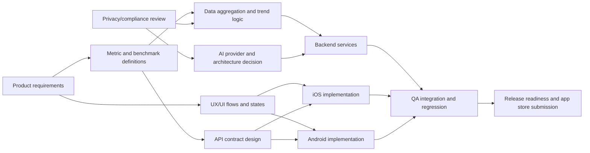

# Delivery Readiness Assessment

## Purpose

The goal of this assessment is to identify unresolved requirements, technical decisions, assumptions, and cross-team dependencies before development begins. The Performance Coaching Hub spans mobile, backend, data, UX, QA, third-party AI services, privacy review, and app store release processes, so the first TPM responsibility is to make the critical path visible and unblock parallel work.

## Open Items List

| # | Open item | Why it must be resolved | Delivery impact if unresolved |
|---|---|---|---|
| 1 | Definition of "similar-level athletes" for benchmarking | Data and Product must agree whether similarity is based on sport, age group, skill level, device type, session volume, geography, or performance bands. | Data cannot design aggregation logic, backend cannot expose benchmark APIs, and UX cannot label comparisons accurately. |
| 2 | Required metrics for session summary | The brief mentions ball speed, accuracy, consistency, fatigue, and trends, but does not define the V1 metric set per sport. | Backend and mobile may implement different assumptions, creating rework and QA ambiguity. |
| 3 | AI coaching tip generation approach | The team needs to decide whether tips are generated synchronously, asynchronously, cached, or generated after session processing completes. | Backend architecture, mobile loading states, QA scenarios, and release reliability all depend on this decision. |
| 4 | Premium entitlement rules | AI tips are premium-only, but entitlement source, offline behavior, expired subscriptions, and family/team accounts are unclear. | Mobile and backend cannot enforce access consistently, creating revenue and support risk. |
| 5 | Privacy and compliance constraints for benchmark data | Comparison data may involve user performance history and potentially sensitive profile metadata. | Data engineering may build unusable cohorts if GDPR/privacy rules are clarified late. |
| 6 | UX scope and screen states | The mobile experience needs happy path, empty state, loading, degraded AI state, benchmark unavailable state, and goal validation states. | Mobile engineers cannot complete implementation or QA cannot write complete test coverage. |
| 7 | AI provider selection and operational limits | Provider latency, quotas, cost, data retention, moderation controls, and API reliability are not defined. | Backend cannot design timeout, retry, cost guardrail, or observability patterns. |
| 8 | Historical data availability and quality | Trend insights and goal progress require reliable historical session data. | Insight accuracy may be weak, and launch scope may need to be reduced if data quality is insufficient. |
| 9 | Release target interpretation | "End of Q3" must include development complete, QA sign-off, production deployment, and App Store / Play Store approval time. | Planning may underestimate final stabilization and submission lead time. |
| 10 | Test environment and seeded data needs | QA will need accounts, sessions, subscriptions, goals, benchmark cohorts, and AI failure simulations. | QA starts late or tests manually, increasing release risk. |

## Technical Decision Log

| Decision | Owner | Needed by | Blocks if not resolved in first two weeks |
|---|---|---|---|
| AI processing model: synchronous API call, async job, or hybrid cache | Backend Lead with TPM and Product | Sprint 0 exit | Backend service design, mobile loading/error states, QA reliability tests |
| Third-party LLM provider and data handling rules | Engineering Lead, Security/Legal, Backend Lead | Sprint 0 exit | AI integration, privacy review, cost model, monitoring |
| Benchmark cohort definition and aggregation method | Product, Data Engineer, Backend Lead | Sprint 0 exit | Data pipeline, benchmark API contract, UX labels |
| V1 metric set and calculation ownership | Product, Data Engineer, Mobile Leads | Sprint 0 exit | Session summary API, mobile display, QA expected results |
| API contract and versioning strategy | Backend Lead and Mobile Leads | Week 2 | Parallel mobile development, mock services, automated tests |
| Premium entitlement enforcement point | Backend Lead and Mobile Leads | Week 2 | AI feature gating, edge cases, release compliance |
| Feature flag and rollout strategy | Backend Lead, Mobile Leads, QA | Week 2 | Safe rollout, partial release, contingency scope |
| Observability requirements for AI and benchmark services | Backend Lead, QA, TPM | Week 2 | Production readiness, incident response, go/no-go criteria |

## Assumption Log

| Assumption | Validation owner | Validation timing |
|---|---|---|
| Existing session ingestion and metric calculation pipelines are production-ready. | Data Engineer / Backend Lead | Sprint 0 |
| Mobile apps already support authentication, subscription entitlement, and post-session navigation. | Mobile Leads | Sprint 0 |
| No firmware or device-side changes are required for V1. | Engineering Lead | Sprint 0 |
| Historical session data is sufficient for basic trend and benchmark calculations. | Data Engineer | Sprint 0-1 |
| AI tips can use a third-party LLM API with approved data minimization. | Backend Lead / Legal | Sprint 0 |
| Q3 target includes app store approval time, not just code complete. | TPM / PM | Sprint 0 |
| Benchmarking can launch with aggregated anonymized ranges rather than individual comparisons. | Product / Legal / Data | Sprint 0 |
| QA automation can be extended for the new critical mobile flows. | QA Lead | Sprint 1 |
| Backend can provide mock APIs before final implementation is complete. | Backend Lead | Sprint 1 |
| AI coaching and benchmarking can be feature flagged independently. | Backend Lead / Mobile Leads | Sprint 1 |

## Dependency Map

## High-Risk Handoff Points

| Handoff | Risk | TPM action |
|---|---|---|
| Product to UX | Missing edge states for AI, benchmarks, and goal validation | Run a state-mapping review before design sign-off |
| UX to Mobile | Designs delivered without API-aware loading/error states | Review flows with mobile and backend leads before handoff |
| Backend to Mobile | API contracts change after mobile begins | Freeze contracts by Week 2 and use mock responses |
| Data to Backend | Benchmark logic changes after endpoint design | Treat cohort definition as a Sprint 0 decision |
| Backend/Mobile to QA | QA receives unstable builds too late | Start QA test planning in Sprint 1 and provide seeded data early |
| QA to Release | App store submission starts after final QA only | Prepare store metadata, flags, and release checklist before QA sign-off |
