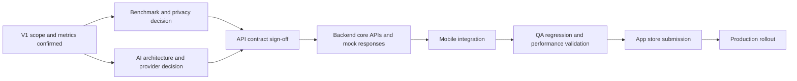

# Delivery Plan

## Planning Model

- Delivery method: Agile/Scrum with two-week sprints
- Target: End of Q3 production release, including app store approval buffer
- Team: 2 mobile engineers, 2 backend engineers, 1 UX/UI designer, 1 data engineer, 2 QA engineers, 1 business analyst
- Estimate scale: S = 1-2 days, M = 3-5 days, L = 1-2 weeks, XL = more than 2 weeks or requires splitting

## Work Breakdown Structure

The detailed WBS is also available as [CSV](../data/work-breakdown-structure.csv).

| Workstream | Task | Owner | Estimate | Prerequisite |
|---|---|---|---|---|
| Discovery | Confirm V1 scope, sports coverage, success metrics | PM, BA, TPM | M | Kickoff |
| Discovery | Define open item owners and decision deadlines | TPM | S | Kickoff |
| UX/UI | Map end-to-end post-session, goals, AI, and benchmark flows | UX/UI Designer | M | V1 scope |
| UX/UI | Design loading, empty, error, premium-gated, and feature-flag states | UX/UI Designer | M | Flow map |
| API Design | Define session summary, goals, AI tip, and benchmark contracts | Backend + Mobile Leads | L | Metric definitions |
| API Design | Publish mock API responses and error schema | Backend | M | API contract draft |
| Data | Validate historical data quality and metric availability | Data Engineer | M | V1 metric list |
| Data | Define benchmark cohort and anonymization rules | Data Engineer + Product + Legal | L | Privacy decision |
| Backend | Build session summary and goal APIs | Backend | L | API sign-off |
| Backend | Implement premium entitlement checks | Backend | M | Entitlement rules |
| Backend | Implement AI integration with timeout, retry, and fallback | Backend | L | Provider decision |
| Backend | Implement benchmark endpoint and aggregation integration | Backend + Data | L | Benchmark logic |
| Mobile | Implement session summary UI and API integration | iOS + Android | L | UX handoff, mock APIs |
| Mobile | Implement goal create/edit/delete/progress flows | iOS + Android | L | UX handoff, goal API |
| Mobile | Implement premium AI tip UI and fallback states | iOS + Android | M | AI API, premium rules |
| Mobile | Implement benchmark visualization | iOS + Android | M | Benchmark API, UX charts |
| QA | Build test plan and seeded data matrix | QA + BA | M | Requirements, API draft |
| QA | Automate critical regression flows | QA | L | Stable mock APIs |
| QA | Execute integration, cross-platform, AI failure, and performance tests | QA | L | Feature complete |
| Release | Prepare feature flags, monitoring, rollback, and app store checklist | TPM + Engineering + QA | M | Development complete |
| Release | Submit builds and monitor rollout | Mobile + TPM + QA | M | QA sign-off |

## Sprint Plan

### Sprint 0: Discovery and Technical Alignment, Weeks 1-2

Done means API contracts are signed off, UX direction is approved, technical decisions are recorded, benchmark and AI architecture are agreed, and QA has enough information to start test planning.

Key deliverables:

- Open items and decision log closed or assigned
- V1 metric set confirmed
- Benchmark definition approved
- AI provider and processing model selected
- API contract draft and mock response plan
- Initial UX flows and state map
- QA test strategy and seeded data needs

### Sprint 1: Foundation and Core Services, Weeks 3-4

Done means session summary and goal tracking foundations are available through mock or early real APIs, and mobile teams can integrate in parallel.

Key deliverables:

- Session summary API skeleton
- Goal API skeleton
- Mock responses and shared error model
- Data validation report
- Mobile screen scaffolding
- QA automation setup for critical flows

### Sprint 2: Session Summary and Goal Tracking, Weeks 5-6

Done means athletes can view session summaries and manage basic goals end-to-end in test environments.

Key deliverables:

- Real session summary API integration
- Goal create/edit/delete/progress flows
- Mobile UI connected to APIs
- Initial regression coverage
- Performance baseline for session summary load

### Sprint 3: AI Coaching Integration, Weeks 7-8

Done means premium users can receive AI coaching tips in a controlled environment with fallback behavior and observability.

Key deliverables:

- AI prompt/input service
- Timeout, retry, fallback, and logging
- Premium entitlement enforcement
- Mobile AI tip UI and error states
- QA cases for provider failure, latency, and entitlement

### Sprint 4: Benchmarking and Feature Completion, Weeks 9-10

Done means benchmark comparison is integrated, anonymized, and testable across mobile platforms.

Key deliverables:

- Benchmark aggregation pipeline
- Benchmark API and visualization
- Privacy validation completed
- Feature flags configured
- Major defects triaged

### Sprint 5: QA Hardening and Release Preparation, Weeks 11-12

Done means there are no critical or high-priority defects open, regression passes, performance targets are met, and release approval is ready.

Key deliverables:

- Full cross-platform regression pass
- AI and benchmark monitoring dashboards
- App store submission package
- Rollback and feature flag plan
- Stakeholder go/no-go review

### Sprint 6: Release and Stabilization, Weeks 13-14

Done means the feature is released or staged for rollout, monitored, and supported with an active incident response path.

Key deliverables:

- App Store and Play Store rollout
- Production monitoring
- Crash-free and AI success-rate tracking
- Hotfix triage process
- Post-launch review

## Critical Path

If any item on the critical path slips by one week, the release likely slips by one week unless scope is reduced or downstream work can proceed against stable mocks. The most dangerous slips are API contract sign-off, AI integration, and QA regression because they block multiple teams simultaneously.

## Milestone Plan

| Milestone | Target | Done means |
|---|---|---|
| Kickoff | Week 1 | Owners confirmed, open items assigned, decision deadlines agreed |
| Technical alignment complete | End Week 2 | AI, benchmark, privacy, metric, entitlement, and API decisions documented |
| API contract sign-off | End Week 2 | Mobile, backend, QA, and data agree on request/response/error schemas |
| Design handoff | End Week 3 | UX flows include all states and are approved for implementation |
| Core experience functional | End Week 6 | Session summary and goal tracking work end-to-end in test environment |
| AI integration functional | End Week 8 | Premium AI tips work with fallback and monitoring |
| Feature complete | End Week 10 | Benchmarking complete, flags enabled, no known architecture gaps |
| QA sign-off | End Week 12 | Regression passes, no critical/high bugs open, performance targets validated |
| Release | End Week 13-14 | App store rollout complete or staged, production monitoring active |

## Resource Plan

### Capacity Assessment

The team can likely hit the Q3 target if scope remains controlled and Sprint 0 decisions are completed on time. The two highest capacity risks are Backend and Data Engineering.

| Team | Capacity concern | Recommendation |
|---|---|---|
| Backend | Owns API contracts, AI integration, entitlement, feature flags, monitoring, and release support. | Split ownership between core APIs and AI integration; publish mocks early. |
| Data | Single engineer owns metric validation, trends, benchmarks, and anonymization. | Keep V1 cohort logic simple and assign backend support for integration tasks. |
| Mobile | Two engineers must build parallel iOS/Android flows across four feature areas. | Use shared contracts and prioritize session summary and goals before AI/benchmark polish. |
| QA | Final sprints may compress cross-platform, AI, privacy, performance, and regression testing. | Start test design in Sprint 0 and automate critical flows from Sprint 1. |
| UX/UI | One designer covers multiple flows and states. | Lock the state map early and avoid late visual redesign after Sprint 2. |

## Week 2 Stakeholder Status Update

We are on track to exit discovery with the core user flows, V1 metric set, and API contract draft aligned across Backend, Mobile, Data, UX, and QA. The main risk is benchmark definition: Product, Data, and privacy review have not yet fully agreed on the similarity model and anonymization rules, which blocks final benchmark API design. AI architecture is trending toward an asynchronous provider integration with cached post-session tips, which should reduce mobile latency risk. To protect the Q3 release, I recommend freezing API contracts this week, keeping benchmark filters simple for V1, and feature-flagging AI coaching and benchmarking independently. I will escalate if benchmark approval is not closed by Friday because it becomes a critical path risk for Sprint 1.

## Scope Trade-Off Scenario: Deadline Moves Three Weeks Earlier

The first conversation should be a scope and risk alignment meeting with PM, VP Engineering, Backend, Data, Mobile, UX, and QA. The goal is not to ask the team to "work faster"; it is to agree which user value must be preserved, which scope can move behind a feature flag, and what risk the business is willing to accept for the conference deadline.

Recommended options:

| Option | What ships for conference | What moves later | Risk |
|---|---|---|---|
| A: Core hub only | Session summary, basic insights, goal tracking | AI coaching, benchmarking | Lowest delivery risk, weaker premium story |
| B: Premium AI limited beta | Session summary, goals, AI tips for selected users | Benchmarking, advanced personalization | Good demo value, requires AI reliability confidence |
| C: Benchmark-lite | Session summary, goals, simple percentile comparison | AI tips, advanced cohort filters | Useful data story, privacy decision still required |
| D: Full scope with reduced QA window | Everything | Nothing | Highest release risk; not recommended |

Recommended TPM position: ship Option B only if AI provider, entitlement, and fallback paths are stable by the midpoint checkpoint. Otherwise ship Option A and demo AI behind an internal-only flag.
